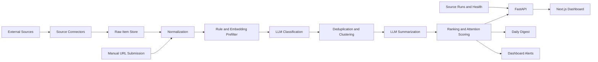

# SignalLens Technical Design

## 1. Purpose

SignalLens is a personal AI intelligence dashboard that collects, filters, summarizes, ranks, and explains AI-related information across research, products, companies, financial news, and Chinese social signals.

This technical design translates the PRD into an implementation plan for the MVP. It intentionally starts with stable sources, clear data contracts, conservative compliance choices, and a modular ingestion layer.

## 2. Design Principles

1. Source connectors are modular and replaceable.
2. Stable APIs and RSS feeds come before fragile scraping.
3. Raw collection, normalization, classification, summarization, clustering, ranking, and presentation are separate stages.
4. LLM cost is controlled by filtering and deduplicating before expensive summarization.
5. Stock-related outputs are informational only and must not become financial advice.
6. User preferences, watchlists, notes, and API keys are private by default.
7. The MVP optimizes for personal usefulness over scale.

## 3. MVP Scope

### Must Have

- Web dashboard with ranked feed.
- Source ingestion from arXiv, Hacker News, GitHub, Product Hunt, Hugging Face, selected RSS feeds, and Finnhub or Alpha Vantage.
- Manual URL submission.
- Topic watchlist.
- AI Stock Watchlist with MU, SNDK, and MRVL seeded initially.
- LLM classification and summarization.
- Basic search.
- Daily digest generation.
- Source health tracking.
- Save, hide, and mark-important actions.
- Clear non-financial-advice disclaimer for stock pages and stock summaries.

### Later

- X/Twitter connector after cost and access validation.
- Xiaohongshu connector after compliant access validation.
- Reddit and WeChat public account connectors.
- Email, Telegram, Discord, Slack, or browser push alerts.
- Multi-user support beyond a lightweight user abstraction.

## 4. Recommended Stack

### Frontend

- Next.js
- React
- TypeScript
- Tailwind CSS
- shadcn/ui or a similarly restrained component system

### Backend

- Python FastAPI
- Pydantic for request and response contracts
- SQLAlchemy or SQLModel for persistence
- Alembic for database migrations

### Data

- PostgreSQL
- pgvector for embeddings and similarity search
- Redis for cache and future queue support

### Jobs

- APScheduler for the first MVP scheduler.
- Celery or RQ later if job volume or retry complexity increases.

### LLM

- Configurable provider layer for OpenAI, Anthropic, Gemini, or future local models.
- Cheap model path for classification.
- Stronger model path for high-value summaries, daily digest, and market-impact reasoning.

## 5. Repository Layout

```text
SignalLens/
  ai_intelligence_dashboard_prd.md
  README.md
  docs/
    technical_design.md
    development_process.md
    conversation_log.md
  apps/
    web/
  services/
    api/
  packages/
    shared/
  infra/
    docker-compose.yml
    postgres/
  scripts/
```

The initial code scaffold should keep frontend and backend separate while sharing API types and constants through `packages/shared` only when real reuse appears.

## 6. System Architecture



## 7. Core Backend Modules

### 7.1 Source Connector Layer

Each connector implements a common interface:

```python
class SourceConnector:
    source_name: str
    source_type: str

    async def fetch(self, cursor: FetchCursor) -> FetchResult:
        ...

    async def normalize(self, raw_item: RawItemInput) -> NormalizedItemInput:
        ...
```

Initial connectors:

- arXiv API
- Hacker News API
- GitHub API
- Product Hunt API
- Hugging Face Hub API
- RSS feed connector
- Finnhub or Alpha Vantage connector
- Manual URL connector

Each connector records:

- Source name and type.
- Access method.
- Authentication requirements.
- Rate limit.
- Polling interval.
- Last successful fetch.
- Failure count and latest error.
- Terms-of-service notes.

### 7.2 Processing Pipeline

Processing stages:

1. Fetch raw items.
2. Store raw source payload and metadata.
3. Normalize title, URL, text, author, language, published time, and source fields.
4. Run rule-based AI relevance prefilter.
5. Generate or retrieve embeddings when useful.
6. Run cheap structured LLM classification for likely relevant items.
7. Deduplicate using URL, content hash, title similarity, and embeddings.
8. Attach items to event clusters.
9. Run stronger LLM summarization for high-value items.
10. Compute ranking and stock attention scores.
11. Generate dashboard feed, stock watchlist views, search index, alerts, and daily digest.

### 7.3 LLM Service

The LLM service exposes stable internal methods:

- `classify_item(normalized_item, user_profile)`
- `summarize_item(normalized_item, classification)`
- `classify_stock_event(normalized_item, watched_tickers)`
- `summarize_event_cluster(cluster)`
- `generate_daily_digest(date, user_profile)`
- `answer_search_query(query, filters)`

All LLM outputs must be parsed as structured JSON and validated before storage.

Batch LLM processing filters summarize-only candidates before spending model calls. When `skip_summarized` is enabled, already summarized feed items are excluded at query time so the requested batch limit is spent on items that still need summaries.

### 7.4 Ranking Service

Feed ranking uses configurable weights:

```text
score =
  0.25 * relevance
+ 0.20 * importance
+ 0.15 * novelty
+ 0.15 * source_quality
+ 0.10 * social_signal
+ 0.10 * stock_relevance
+ 0.05 * freshness
```

Stock watchlist ranking uses:

```text
stock_attention_score =
  0.30 * high_impact_news_score
+ 0.20 * price_movement_score
+ 0.20 * ai_relevance_score
+ 0.15 * social_discussion_score
+ 0.10 * source_quality_score
+ 0.05 * user_priority_score
```

The MVP can compute these as deterministic functions over stored fields. Later versions can learn from save, hide, and mark-important feedback.

Source quality is deterministic in the MVP. Structured research and official APIs receive the highest baseline credibility; community, RSS, manual, and experimental sources receive lower baseline scores. The stored `source_quality_score` is then used by ranking, importance, and digest selection without requiring an LLM call.

Daily digest ordering uses a deterministic blended score across importance, relevance, source quality, classifier confidence, stock impact, and novelty. This keeps the morning briefing biased toward useful and trustworthy items while preserving high-priority user-marked items at the top.

Alert generation applies the same trust posture. Single-item alerts require enough classification confidence and source quality before a rule can fire, and cross-source alerts require enough cluster confidence before a repeated signal is promoted as confirmed. Alert reasons include the trust signals used for the decision so the user can audit why something was surfaced.

## 8. Data Model

### 8.1 Main Tables

- `sources`
- `source_runs`
- `raw_items`
- `normalized_items`
- `item_classifications`
- `item_summaries`
- `event_clusters`
- `event_cluster_items`
- `tickers`
- `stock_watchlist_items`
- `company_watchlist_items`
- `topics`
- `topic_watchlist_items`
- `product_watchlist_items`
- `user_preferences`
- `saved_items`
- `hidden_items`
- `alert_rules`
- `alerts`
- `daily_digests`

### 8.2 Important Fields

`raw_items` stores original metadata and source payloads when allowed:

- `id`
- `source_id`
- `external_id`
- `url`
- `raw_title`
- `raw_text`
- `raw_author`
- `raw_metadata`
- `content_hash`
- `published_at`
- `fetched_at`

`normalized_items` stores display-ready and searchable content:

- `id`
- `raw_item_id`
- `title`
- `url`
- `source_name`
- `author`
- `language`
- `published_at`
- `text`
- `category`
- `subcategory`
- `tickers`
- `companies`
- `products`
- `topics`
- `sentiment`
- `relevance_score`
- `importance_score`
- `novelty_score`
- `source_quality_score`
- `stock_impact_score`
- `created_at`

`stock_watchlist_items` stores the editable watchlist:

- `id`
- `user_id`
- `ticker`
- `company_name`
- `exchange`
- `sector`
- `industry`
- `priority`
- `group_name`
- `is_pinned`
- `is_holding`
- `shares`
- `average_cost`
- `related_keywords`
- `related_companies`
- `related_ai_themes`
- `notes`
- `created_at`
- `updated_at`

For MVP privacy, `shares` and `average_cost` should remain nullable and hidden unless the user explicitly enables portfolio note mode.

## 9. API Design

### Dashboard

- `GET /api/feed`
- `GET /api/feed/{item_id}`
- `POST /api/feed/{item_id}/save`
- `POST /api/feed/{item_id}/hide`
- `POST /api/feed/{item_id}/mark-important`

### Search

- `GET /api/search`
- `POST /api/search/natural-language`

### Watchlists

- `GET /api/watchlists/topics`
- `POST /api/watchlists/topics`
- `DELETE /api/watchlists/topics/{topic_id}`
- `GET /api/watchlists/companies`
- `POST /api/watchlists/companies`
- `PATCH /api/watchlists/companies/{company_key}`
- `DELETE /api/watchlists/companies/{company_key}`
- `GET /api/watchlists/stocks`
- `POST /api/watchlists/stocks`
- `PATCH /api/watchlists/stocks/{watchlist_item_id}`
- `DELETE /api/watchlists/stocks/{watchlist_item_id}`

### Stocks

- `GET /api/stocks/watchlist-dashboard`
- `GET /api/stocks/{ticker}`
- `GET /api/stocks/{ticker}/events`
- `GET /api/stocks/{ticker}/price-series`

### Sources

- `GET /api/sources`
- `PATCH /api/sources/{source_id}`
- `GET /api/sources/health`
- `POST /api/sources/{source_id}/run`

### Manual Submission

- `POST /api/manual-submissions`

### Digest and Alerts

- `GET /api/digests/daily`
- `POST /api/digests/daily/generate`
- `GET /api/alerts`
- `POST /api/alerts/rules`
- `PATCH /api/alerts/rules/{rule_id}`

## 10. Frontend Information Architecture

Primary navigation:

- Dashboard
- AI Trends
- Research
- AI Products
- AI Stocks
- Chinese Trends
- Saved
- Daily Digest
- Search
- Source Health
- Settings

Important pages:

- Dashboard feed with ranked item cards.
- Category feeds with filters.
- AI Stock Watchlist table.
- Stock detail page with price chart, AI-related timeline, summaries, and notes.
- Event cluster page with timeline and related sources.
- Daily digest page.
- Source health page.
- Settings page for API keys, source configuration, ranking weights, and watchlists.

## 11. UI Design Direction

The product is an operational intelligence dashboard, not a marketing site. The interface should be quiet, dense, and built for repeated scanning.

Recommended UI behavior:

- Use compact tables for stock watchlist and source health.
- Use feed cards for intelligence items.
- Use tabs for stock detail sections.
- Use filters and segmented controls for category views.
- Use restrained color for severity, sentiment, and source health.
- Keep the financial disclaimer visible on stock pages and stock summaries.

## 12. Compliance and Privacy

Source rules:

- Prefer official APIs and RSS feeds.
- Do not bypass login, anti-bot, captcha, device fingerprinting, or access controls.
- Store URLs, metadata, summaries, and short excerpts only where appropriate.
- Avoid storing full copyrighted articles unless the source permits it.
- Keep source terms notes in `sources.terms_notes`.

Finance rules:

- Include: "This product is for information organization only. It does not provide financial advice."
- Never generate buy, sell, or hold recommendations.
- Use conservative labels such as positive, negative, mixed, uncertain, and confidence score.

Privacy rules:

- Keep API keys in environment variables or a secrets manager.
- Do not commit secrets.
- Keep holdings, notes, saved items, and reading history private.
- Make position fields optional and disabled by default.

## 13. Deployment Plan

### Local MVP

- Docker Compose with PostgreSQL, Redis, FastAPI, and Next.js.
- `.env` for provider keys and database URL.
- APScheduler runs inside the API process for early development.

### Small Cloud Deployment

- Render, Railway, Fly.io, or a small VPS.
- Managed PostgreSQL where possible.
- Separate worker process once job volume grows.
- Cron-triggered daily digest generation.

## 14. Testing Strategy

Backend:

- Unit tests for connectors using recorded fixtures.
- Unit tests for scoring functions.
- Contract tests for LLM JSON parsing.
- API tests for watchlist CRUD, feed retrieval, manual submission, and search.

Frontend:

- Component tests for feed cards, stock table, source health table, and filters.
- Playwright tests for dashboard, stock watchlist, item actions, and manual URL submission.

Data quality:

- Relevance precision checks.
- Duplicate-rate checks.
- Source failure-rate tracking.
- Summary JSON validation.

## 15. Implementation Phases

### Phase 0: Source Validation

- Validate arXiv, Hacker News, GitHub, Product Hunt, Hugging Face, RSS, and finance provider access.
- Produce source feasibility table and API-key checklist.
- Decide whether Finnhub or Alpha Vantage is the primary finance source.

### Phase 1: Backend MVP

- Scaffold FastAPI service.
- Add PostgreSQL and migrations.
- Implement source connector interface.
- Implement arXiv, Hacker News, RSS, and finance news connectors first.
- Implement watchlist CRUD.
- Implement source health tracking.

### Phase 2: Intelligence Layer

- Add LLM provider abstraction.
- Add structured classification.
- Add summarization.
- Add ranking.
- Add daily digest generation.

### Phase 3: Frontend MVP

- Scaffold Next.js app.
- Build dashboard feed.
- Build AI Stock Watchlist.
- Build stock detail page.
- Build source health page.
- Build search and saved items.

### Phase 4: Alerts and Personalization

- Add dashboard alerts.
- Add ranking weight settings.
- Add feedback-aware ranking.
- Add manual URL submission flow if not already shipped.

### Phase 5: Advanced Sources

- Add Hugging Face trending depth.
- Add X/Twitter if official access is acceptable.
- Add Xiaohongshu only after compliant access is validated.
- Add additional finance and company sources.

## 16. Open Decisions

1. Primary finance provider: Finnhub or Alpha Vantage.
2. LLM provider order and default model choices.
3. Whether to use SQLAlchemy or SQLModel.
4. Whether to start with a monorepo package manager such as pnpm.
5. Whether local development should require Docker from day one.
6. Whether portfolio note mode should be included in the first frontend release or hidden until later.

## 17. First Build Recommendation

Start with Phase 0 and Phase 1 only:

1. Scaffold FastAPI and PostgreSQL.
2. Seed stock watchlist with MU, SNDK, and MRVL.
3. Implement arXiv, Hacker News, RSS, and one finance-news connector.
4. Store raw and normalized items.
5. Show source health and a simple API-fed dashboard.

This creates the backbone before spending effort on richer LLM summaries or a polished frontend.
