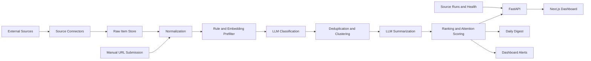

# SignalLens Technical Design

## 1. Purpose

SignalLens is a personal AI intelligence dashboard that collects, filters, summarizes, ranks, and explains AI-related information across research, products, companies, financial news, and Chinese social signals.

This technical design translates the PRD into an implementation plan for the MVP. It intentionally starts with stable sources, clear data contracts, conservative compliance choices, and a modular ingestion layer.

## 2. Design Principles

1. Source connectors are modular and replaceable.
2. Stable APIs and RSS feeds come before fragile scraping.
3. Raw collection, normalization, classification, summarization, clustering, ranking, and presentation are separate stages.
4. LLM cost is controlled by filtering and deduplicating before expensive summarization.
5. Stock-related outputs are informational only and must not become financial advice.
6. User preferences, watchlists, notes, and API keys are private by default.
7. The MVP optimizes for personal usefulness over scale.

## 3. MVP Scope

### Must Have

- Web dashboard with ranked feed.
- Source ingestion from arXiv, Hacker News, GitHub, Product Hunt, Hugging Face, selected RSS feeds, Alpha Vantage, and SEC EDGAR filings.
- Manual URL submission.
- Topic watchlist.
- AI Stock Watchlist with MU, SNDK, and MRVL seeded initially.
- LLM classification and summarization.
- Basic search.
- Daily digest generation.
- Source health tracking.
- Save, hide, and mark-important actions.
- Clear non-financial-advice disclaimer for stock pages and stock summaries.

### Later

- X/Twitter connector after cost and access validation.
- Xiaohongshu connector after compliant access validation.
- Reddit and WeChat public account connectors.
- Email, Telegram, Discord, Slack, or browser push alerts.
- Multi-user support beyond a lightweight user abstraction.

## 4. Recommended Stack

### Frontend

- Next.js
- React
- TypeScript
- Tailwind CSS
- shadcn/ui or a similarly restrained component system

### Backend

- Python FastAPI
- Pydantic for request and response contracts
- SQLAlchemy or SQLModel for persistence
- Alembic for database migrations

### Data

- PostgreSQL
- pgvector for embeddings and similarity search
- Redis for cache and future queue support

### Jobs

- APScheduler for the first MVP scheduler.
- Celery or RQ later if job volume or retry complexity increases.

### LLM

- Configurable provider layer for OpenAI, Anthropic, Gemini, or future local models.
- Cheap model path for classification.
- Stronger model path for high-value summaries, daily digest, and market-impact reasoning.

## 5. Repository Layout

```text
SignalLens/
  ai_intelligence_dashboard_prd.md
  README.md
  docs/
    technical_design.md
    development_process.md
    conversation_log.md
  apps/
    web/
  services/
    api/
  packages/
    shared/
  infra/
    docker-compose.yml
    postgres/
  scripts/
```

The initial code scaffold should keep frontend and backend separate while sharing API types and constants through `packages/shared` only when real reuse appears.

## 6. System Architecture



## 7. Core Backend Modules

### 7.1 Source Connector Layer

Each connector implements a common interface:

```python
class SourceConnector:
    source_name: str
    source_type: str

    async def fetch(self, cursor: FetchCursor) -> FetchResult:
        ...

    async def normalize(self, raw_item: RawItemInput) -> NormalizedItemInput:
        ...
```

Initial connectors:

- arXiv API
- Hacker News API
- GitHub API
- Product Hunt API
- Hugging Face Hub API
- RSS feed connector
- Alpha Vantage connector
- SEC EDGAR submissions connector
- Manual URL connector

Each connector records:

- Source name and type.
- Access method.
- Authentication requirements.
- Rate limit.
- Polling interval.
- Last successful fetch.
- Failure count and latest error.
- Terms-of-service notes.

The Source Health dashboard treats followed sources as editable configuration, not static seed data. Operators can update source name, type, access method, URL/feed, authentication-required status, priority, polling interval, rate-limit notes, and terms/scope notes after creation. The backend protects required source names, rejects duplicate renames, ignores null priority updates, clears blank optional fields, and re-applies connector-specific normalization for GitHub repositories, Product Hunt topics, and public social-keyword RSS feeds.

### 7.2 Processing Pipeline

Processing stages:

1. Fetch raw items.
2. Store raw source payload and metadata.
3. Normalize title, URL, text, author, language, published time, and source fields.
4. Run rule-based AI relevance prefilter.
5. Generate or retrieve embeddings when useful.
6. Run cheap structured LLM classification for likely relevant items.
7. Deduplicate using canonical URL, content hash, title similarity, and embeddings.
8. Attach items to event clusters.
9. Run stronger LLM summarization for high-value items.
10. Compute ranking and stock attention scores.
11. Generate dashboard feed, stock watchlist views, search index, alerts, and daily digest.

### 7.3 LLM Service

The LLM service exposes stable internal methods:

- `classify_item(normalized_item, user_profile)`
- `summarize_item(normalized_item, classification)`
- `classify_stock_event(normalized_item, watched_tickers)`
- `summarize_event_cluster(cluster)`
- `generate_daily_digest(date, user_profile)`
- `answer_search_query(query, filters)`

All LLM outputs must be parsed as structured JSON and validated before storage.
The classifier accepts the PRD category set, including secondary categories such as policy/regulation, infrastructure, funding/M&A, benchmark/evaluation, open-source release, tutorial/opinion, and noise/irrelevant. These values are stored as normalized snake_case labels and folded into the existing first-class dashboard modules for MVP navigation: benchmark/evaluation into Research, funding/M&A into AI Stocks, and policy/regulation, infrastructure, open-source release, and tutorial/opinion into AI Trends. Feed serialization derives an `is_ai_related` flag from category, relevance, and extracted entities, derives related `technologies` from stored topic tags and optional LLM technology outputs, and derives a `market_impact_type` from existing sentiment, stock-impact score, entity extraction, and event terms. Feed cards, item details, alerts, and digest labels expose these PRD classification facets without requiring a schema migration.

Batch LLM processing filters summarize and classify candidates before spending model calls. When `skip_summarized` is enabled, already summarized feed items are excluded at query time so the requested batch limit is spent on items that still need summaries. When `skip_classified` is enabled, items whose classifier confidence is at or above the configured threshold are skipped so batch classification focuses on lower-confidence items. Hidden items, blocked sources, and optional PRD module scopes are excluded before candidate selection so local source preferences and current dashboard context do not spend LLM budget on irrelevant items. Candidate rows must also have enough deterministic relevance, importance, stock-impact score, or an explicit user important mark before entering the model-call pool, matching the PRD requirement to summarize only high-relevance content while preserving user judgment. Raw ingestion strips tracking query parameters before content hashing, checks existing raw rows by canonical URL, and suppresses same-source same-day near-title duplicates before normalization, so equivalent feed/news URLs and mirror-style reposts are deduplicated while next-day follow-ups can still enter the event timeline. Normalized items receive a deterministic novelty score from recent title similarity: first-seen items stay fully novel, same-source follow-ups are discounted more strongly, and cross-source follow-ups retain more novelty as confirmation evidence. The candidate selector also overfetches a bounded set, removes exact duplicate URLs after stripping tracking parameters, and removes exact normalized title repeats before returning the capped batch, preserving Kimi budget for distinct items while keeping related cross-source discussion eligible. Batch responses include the model-call budget, attempted calls, succeeded calls, failed calls, skipped calls, and unused budget so the dashboard can show how much of a manual LLM action's capped spend was actually used. Expanded feed item details derive PRD summary profiles from stored summaries without another model call: one-line summary, card bullets, technical summary, market-watch summary, and the source of the summary fallback.

The dashboard exposes batch LLM classification and summarization as separate actions against `/api/llm/process-feed`, making cost-bearing enrichment explicit while still supporting the PRD requirement for LLM classification and LLM summarization. When the active view is AI Trends, Research, Products, AI Stocks, or Chinese Social, the dashboard sends the matching `module` value so the capped Kimi batch enriches the current module instead of the global feed.

Every successful classification, summarization, stock briefing summary, and event cluster explanation call writes a local `llm_usage_events` ledger row with provider, model, operation, linked item when available, and token counts returned by the provider. `/api/quality-metrics` aggregates recent call and token totals, plus operation-level token buckets, so System Readiness can show local LLM spend pressure without requiring a paid billing API. Optional local price assumptions from `LLM_INPUT_COST_PER_1M_TOKENS`, `LLM_OUTPUT_COST_PER_1M_TOKENS`, and `LLM_MONTHLY_BUDGET_USD` convert the same ledger into estimated window spend, monthly projection, budget usage, cost per recent item, cost per saved digest, cost per active alert, and operation-level cost estimates. Source API cost uses recent `source_runs` as the MVP call-volume proxy; optional `SOURCE_API_COST_PER_1K_CALLS_USD` and `SOURCE_API_MONTHLY_BUDGET_USD` settings convert those runs into estimated API spend, monthly projection, budget usage, and cost per recent item, saved digest, and active alert. Pricing defaults to zero so SignalLens never invents provider billing data when the user has not configured current prices.

### 7.4 Ranking Service

Feed ranking uses configurable weights:

```text
score =
  0.25 * relevance
+ 0.20 * importance
+ 0.15 * novelty
+ 0.15 * source_quality
+ 0.10 * social_signal
+ 0.10 * stock_relevance
+ 0.05 * freshness
```

Stock watchlist ranking uses:

```text
stock_attention_score =
  0.30 * high_impact_news_score
+ 0.20 * price_movement_score
+ 0.20 * ai_relevance_score
+ 0.15 * social_discussion_score
+ 0.10 * source_quality_score
+ 0.05 * user_priority_score
```

The MVP computes these as deterministic functions over stored fields, source metadata, and explicit local feedback. Hidden items are removed from personal views but remain recoverable through a hidden-only feed query and `POST /api/feed/{item_id}/unhide`; marked-important items are ranked first and can be restored to normal priority through `POST /api/feed/{item_id}/unmark-important`; saved items receive a lightweight ranking boost so the main feed gradually reflects what the user keeps. The feed interest profile also learns small bounded preferences from saved/important and hidden items, lifting matching sources/topics/entities and dampening repeated noisy matches without hiding them automatically. Expanded item details show personalization notes when a source, topic, product, company, or ticker matches prior saved/important or hidden feedback, keeping recommendation learning auditable. Read/unread state is stored on user item actions, and saved-but-unread items drive the digest read-later section. Feed responses compute `social_signal_score` from free engagement metadata such as GitHub stars/stars-per-day/forks, Hacker News score/comment count, Product Hunt votes/comments, and Hugging Face downloads/likes, then use that score in ranking and digest ordering without requiring an additional paid API or schema migration. Feed serialization preserves stored LLM `why_it_matters` text when available and otherwise generates a deterministic category/entity/signal fallback, including product use-case focus for product items, so item cards, details, digest, and exports keep the PRD explanation affordance even before paid summarization runs. Hacker News items also convert bounded top-comment previews into deterministic discussion summaries so developer conversation can be scanned without broad comment crawling or extra LLM spend. Feed item details include deterministic uncertainty notes derived from classifier confidence, source quality, stock-impact linkage, summary availability, and manual-submission context so every expanded item can be audited before acting on it.

Per-item personal metadata is stored on `user_item_actions` rather than the source item itself. Expanded feed details can save a private personal note and normalized manual tags through `PATCH /api/feed/{item_id}/personal-metadata`, supporting the PRD saved-article notes and manual-tag workflow while keeping reading context user-local. The Saved Items panel surfaces notes, tags, read/read-later state, read timestamps, and read toggles inline, orders unread saved items before completed reading, and shows read-later/read counts so the saved list behaves like a lightweight reading queue. Tag chips run a saved-only manual-tag search so curated reading lists can become quick working filters. Saved items can also be exported through `GET /api/feed/saved/export/markdown` and copied or downloaded from the dashboard as Markdown with source/date/read status, labels, private notes, manual tags, and stored summaries, keeping the reading queue portable without another service. `DELETE /api/feed/{item_id}` permanently removes a feed item, its raw source text, personal action state, item alerts, and digest snapshots that still contain the item title or URL, while preserving LLM cost history with the item link cleared. The dashboard exposes this as a confirmed delete action on feed cards and hidden items for PRD privacy/compliance deletion. Natural-language search treats "read later" and "to read" as saved-unread filters, matching the digest read-later section rather than a broad unread-only search.

Personal configuration can be exported through `GET /api/settings/backup` and restored through `POST /api/settings/restore`. The JSON backup includes ranking preferences, language/source preferences, followed sources, alert rules, and stock/company/topic/product watchlists, but excludes API keys, raw source text, normalized feed items, saved-item notes, LLM usage history, and source run history. Restore is an upsert rather than a destructive sync, so missing backup rows do not erase existing local configuration. The Settings dashboard exposes download and restore controls for this backup, supporting local Mac moves or recovery without adding paid storage. The no-paid demo smoke verifier exports seeded local configuration, temporarily mutates preferences, restores the backup, and asserts that the original preference lists and upsert counts are recovered.

Source quality is deterministic in the MVP. Structured research and official APIs receive the highest baseline credibility; community, RSS, manual, and experimental sources receive lower baseline scores. The stored `source_quality_score` is then used by ranking, importance, and digest selection without requiring an LLM call.

Daily digest ordering uses a deterministic blended score across importance, relevance, source quality, classifier confidence, social signal, stock impact, and novelty. This keeps the morning briefing biased toward useful and trustworthy items while preserving high-priority user-marked items at the top. Digest generation also applies local visibility rules, so hidden items and blocked sources are excluded from date selection, section contents, active-alert context, source coverage, markdown export, and saved snapshots. Daily digest responses and markdown include compact active-alert summaries so urgent stock, product, social-trend, or cross-source signals are visible in the morning briefing without requiring a separate alert-panel scan.

Search and event cluster APIs use the same local ranking preferences as the main feed, including configurable weights, preferred sources, blocked sources, and optional PRD module scopes. Natural-language search returns inferred filters plus a deterministic local briefing for summary-style queries such as “summarize the most important semiconductor AI news this week,” using stored titles, summaries, sources, tickers, topics, and scores without spending LLM calls. Recent/latest searches infer a seven-day lower bound, while today/yesterday searches infer exact UTC calendar-day bounds and expose both `date_from` and `date_to` to the dashboard. Event clusters include deterministic MVP explanations and uncertainty notes derived from sources, shared topics, extracted tickers, classifier confidence, and timeline coverage. Cluster responses expose `source_count`, `duplicate_item_count`, and `confirmation_level` so the dashboard can distinguish single-source candidates, repeated single-source coverage, normal cross-source confirmation, and stronger cross-source confirmation without an LLM call. Strong entity clusters use both the extracted ticker/product and a lightweight event signature from titles and topics, so unrelated same-ticker developments such as chip launches and earnings guidance do not collapse into one broad stock bucket. The dashboard can request an on-demand Kimi cluster explanation for expanded cluster evidence, making PRD-level LLM explanations explicit and cost-controlled instead of automatic. Cluster timeline rows show date, source, title, and importance so the PRD event timeline can be read without opening every evidence link. When a cluster has an extracted ticker, the DB-backed cluster list/detail responses attach the latest stock market snapshot for the first related ticker so the dashboard can show price context alongside source evidence. The main feed, default search, and digest generation also honor language preferences when no explicit search language is supplied, keeping English/Chinese views aligned with the user's current reading focus instead of exposing separate global views. Searches launched from AI Trends, Research, Products, AI Stocks, or Chinese Social stay inside that active module and update the module result cache so the visible list matches the returned search results; clearing search from a module reloads that module's ranked feed directly instead of temporarily falling back to a global feed refresh.

Alert generation applies the same trust posture and local visibility rules. Single-item alerts require enough classification confidence and source quality before a rule can fire, hidden feed items and blocked sources are excluded, and cross-source alerts require enough cluster confidence before a repeated signal is promoted as confirmed. Stock price-move alerts combine the latest daily close-to-close move for watched or rule-matched tickers with a stock-linked AI item, so dashboard urgency can reflect both news relevance and whether the price already reacted while keeping the non-financial-advice posture. System Readiness tracks the latest watched-stock price snapshot date, flags missing or stale price data for active stock watchlists, and can launch the Alpha Vantage price refresh action directly so stock-sensitive alerts and briefings are not reviewed against stale market context. Generic alert rules fold PRD secondary categories into their parent alert scopes, so research rules cover benchmark/evaluation, stock/company rules cover funding/M&A, and AI trend rules cover policy/regulation, infrastructure, open-source release, and tutorial/opinion items. Specialized stock-sensitive alert categories cover earnings/guidance mentions, analyst actions, supply-chain signals, and multi-source theme breakouts using deterministic term and topic matching over existing normalized items. A social-trend alert category detects viral AI products, Chinese/social-platform signals, and high-engagement community launches from existing metadata such as Product Hunt votes, Hacker News activity, GitHub traction, public RSS language, inferred product entities, and PRD product use-case labels without requiring a paid social API. Alert rules can be disabled or snoozed until a specific timestamp; snoozed rules remain editable but are excluded from every alert generator until they resume. Dashboard rule details can update names, descriptions, categories, severities, importance thresholds, stock-impact thresholds, tickers, and topics after creation, while backend guards keep required text fields named and clamp score thresholds to the valid range. Dismissed alerts remain queryable as history, while dashboard metrics continue to count active alerts only. Alert reasons include the trust signals used for the decision so the user can audit why something was surfaced.

## 8. Data Model

### 8.1 Main Tables

- `sources`
- `source_runs`
- `raw_items`
- `normalized_items`
- `item_classifications`
- `item_summaries`
- `event_clusters`
- `event_cluster_items`
- `tickers`
- `stock_watchlist_items`
- `company_watchlist_items`
- `topics`
- `topic_watchlist_items`
- `product_watchlist_items`
- `user_preferences`
- `saved_items`
- `hidden_items`
- `alert_rules`
- `alerts`
- `daily_digests`

### 8.2 Important Fields

`raw_items` stores original metadata and source payloads when allowed:

- `id`
- `source_id`
- `external_id`
- `url`
- `raw_title`
- `raw_text`
- `raw_author`
- `raw_metadata`
- `content_hash`
- `published_at`
- `fetched_at`

`normalized_items` stores display-ready and searchable content:

- `id`
- `raw_item_id`
- `title`
- `url`
- `source_name`
- `author`
- `language`
- `published_at`
- `text`
- `category`
- `subcategory`
- `tickers`
- `companies`
- `products`
- `topics`
- `sentiment`
- `relevance_score`
- `importance_score`
- `novelty_score`
- `source_quality_score`
- `stock_impact_score`
- `created_at`

`stock_watchlist_items` stores the editable watchlist:

- `id`
- `user_id`
- `ticker`
- `company_name`
- `exchange`
- `sector`
- `industry`
- `priority`
- `group_name`
- `display_order`
- `is_pinned`
- `is_holding`
- `shares`
- `average_cost`
- `related_keywords`
- `related_companies`
- `related_ai_themes`
- `notes`
- `created_at`
- `updated_at`

For MVP privacy, `shares` and `average_cost` remain nullable and hidden in the dashboard unless the user explicitly enables portfolio note mode for a selected stock. Saving ordinary stock metadata does not expose hidden portfolio fields, and saving with portfolio note mode disabled clears `is_holding`, `shares`, and `average_cost` so private position data can be removed from the dashboard. Stock watchlist ordering uses pinned status first, then a durable `display_order` value that can be changed from the dashboard with up/down controls, then priority and ticker as tie-breakers. The stock move API normalizes the current pinned or unpinned group and swaps the selected ticker with its adjacent neighbor, keeping repeated reorder actions deterministic even after older rows have duplicate order values.

## 9. API Design

### Dashboard

- `GET /api/feed`
- `GET /api/feed/{item_id}`
- `POST /api/feed/{item_id}/save`
- `POST /api/feed/{item_id}/hide`
- `POST /api/feed/{item_id}/unhide`
- `POST /api/feed/{item_id}/mark-important`
- `POST /api/feed/{item_id}/unmark-important`
- `POST /api/feed/{item_id}/mark-read`
- `POST /api/feed/{item_id}/mark-unread`
- `PATCH /api/feed/{item_id}/personal-metadata`

### Search

- `GET /api/search`
- `POST /api/search/natural-language`

Natural-language search infers source, category, product use-case subcategory, ticker, company, topic, manual tag, language, date, importance, saved-item, and read-status filters, then applies those inferred filters to the database query so dashboard search chips reflect the actual result set. Manual search filters include source names, product use-case subcategories, company entities, read status, AI-relevance audit state, and personal manual tags, and free-text search matches stored entity arrays such as tickers, companies, products, topics, plus private personal notes and manual tags. The ranked feed API also accepts a topic filter, including slug and singular/plural variants, so the dashboard can offer watchlist-topic quick filters without leaving the main feed. The search panel also renders watched-stock ticker chips that run ticker-scoped search directly from the stock watchlist, making AI stock monitoring accessible from the main feed without opening each stock detail view.

### Watchlists

- `GET /api/watchlist/topics`
- `POST /api/watchlist/topics`
- `DELETE /api/watchlist/topics/{topic}`
- `GET /api/watchlist/companies`
- `POST /api/watchlist/companies`
- `GET /api/watchlist/companies/{company_key}/briefing`
- `PATCH /api/watchlist/companies/{company_key}`
- `DELETE /api/watchlist/companies/{company_key}`
- `GET /api/watchlist/stocks`
- `POST /api/watchlist/stocks`
- `POST /api/watchlist/stocks/{ticker}/briefing/llm-summary`
- `PATCH /api/watchlist/stocks/{ticker}`
- `POST /api/watchlist/stocks/{ticker}/move`
- `DELETE /api/watchlist/stocks/{ticker}`
- `GET /api/watchlist/products`
- `POST /api/watchlist/products`
- `PATCH /api/watchlist/products/{category}`
- `DELETE /api/watchlist/products/{category}`

The dashboard surfaces stock, company, topic, and product-category watchlists as editable operational panels. Stock watchlist creation accepts either a ticker or a company name. The backend resolves seeded PRD stocks and known ticker aliases to canonical ticker, company, exchange, sector, industry, group, priority, and related AI themes without calling a paid market-data API; unknown ticker-only entries remain addable with safe defaults so the user can track niche names before metadata enrichment is available. The selected stock detail editor can update display/company name, exchange, sector, industry, group, notes, related keywords, related companies, and related AI themes so the PRD stock relevance profile is user-maintainable after creation. Blank stock display name, exchange, sector, industry, priority, and group updates are ignored so required watchlist metadata cannot be accidentally erased, while optional notes can still be cleared. Company watchlist details can update company name, ticker, category, related terms, and notes from the dashboard, keeping public-company and private-lab matching tunable after first setup. Blank company names, categories, and priorities are ignored, while optional ticker and note fields can be cleared. Topic watchlist details can update label, category, related terms, and notes from the dashboard; topic notes become the briefing definition, and blank label/category edits are ignored so curated topics remain named. Product-category watchlist details can update label, related terms, and notes from the dashboard, keeping AI Products matching and launch briefings tunable after first setup. Blank product labels are ignored so product categories remain named. Company watchlists support public tickers and private AI labs, and their terms feed into ranking personalization. Source Health doubles as the PRD source watchlist: followed sources can be created, edited, disabled, blocked from personal views, run on demand, and filtered by health state. The dashboard source form includes templates for public blog RSS, company blogs, GitHub repositories, Product Hunt topics, Chinese/public social RSS feeds, and manual watch sources; selecting a template fills compliant type, access method, polling, rate-limit, and scope-note defaults while leaving the user to enter the actual source name and URL. The manual seed script and scheduled ingestion cycle both seed stock, company, topic, and product-category watchlists so first-run dashboards have useful defaults across all first-class modules, and the Source Health cycle summary reports those seeded counts. The seed script also supports an opt-in `--demo-data` mode, and the dashboard can call `POST /api/ingestion/demo-data` from System Readiness when no recent items exist. This creates local example feed items across AI Trends, Research, Products, AI Stocks, and Chinese Social, a saved manual URL submission in the read-later workflow, source-run evidence, stock price points, default alert rules, generated alerts, and a saved daily digest snapshot, giving budget-limited local installs a usable dashboard without paid or optional API calls. `.venv/bin/python scripts/smoke_test_demo.py` verifies this local MVP path with an in-memory database by seeding demo data and checking the feed, saved manual capture, first-class modules, stock dashboard, source health, daily digest, saved digest snapshot, event clusters, alerts, health, quality metrics, and settings backup/restore without starting Postgres or calling external providers. Repo-root scripts such as `pnpm infra:up`, `pnpm api:migrate`, `pnpm api:seed-demo`, `pnpm api:dev`, `pnpm web:dev`, and `pnpm verify:demo` keep the local MVP setup and verification workflow runnable from one place. Watchlist list APIs also seed their default records when a local database is empty, so first-run dashboard defaults are immediately editable instead of ephemeral placeholders. Watchlist summaries and drill-down briefings apply blocked-source preferences so hidden/noisy sources do not reappear inside stock, company, topic, or product detail panels. Source Health rows can add or remove a source from blocked-source preferences, making the PRD bad-source hiding workflow reversible where failures and low-quality sources are reviewed. Source Health and Settings are also first-class navigation modules, rendering their operational panels in the main column instead of only as sidebar utilities.

Stock briefing timelines include conservative price-reaction labels that compare the inferred market-impact direction with the latest available daily price move and, when stored price history covers the news date, the first available trading-day move on or after the signal timestamp. Market snapshots also include latest close, close-to-close price change, and close-to-close volume change when two daily price rows are available. Stock summaries expose a `today_signal_count` for the current UTC day and a `last_updated_at` timestamp from the latest stock signal or market price date so the dashboard table can distinguish fresh activity from stale watchlist rows. Stock summaries and briefings also expose compact `attention_reasons` derived from the deterministic scoring inputs, plus `attention_components` with value, weight, and contribution for the implemented PRD ranking formula: high-impact news, price movement, AI relevance, social discussion, source quality, and user priority. The stock table defaults to pinned-first attention ordering so the strongest daily AI/market signals float to the top within pinned and unpinned groups, while a watchlist-order mode preserves manual display-order controls for personal curation. The selected stock detail view uses tabs for overview, signals, related clusters, personal notes, and LLM summary sections; it also fetches extended price history and provides an honest 1D latest-daily-close view plus 5D, 1M, 6M, and 1Y chart ranges, while loaded event clusters that mention the stock ticker remain visible alongside the price context. The personal notes tab shows watchlist notes plus saved, important, read-later, privately noted, or manually tagged stock-linked signals from the briefing evidence so saved articles and manual tags remain visible in the stock workflow. Stock detail pages can request an on-demand Kimi briefing summary with the PRD sections "What happened", "Why it matters", "Possible market relevance", and "Uncertainties"; the model call is user-triggered and constrained to supplied evidence. Together, these labels and summaries help answer whether a stock-related signal appears to have aligned with, diverged from, or lacked visible price reaction while preserving the cost-control and non-financial-advice posture.

Daily digest responses include both ticker and company watchlist context so the user can see which personal focus areas shaped the briefing. Digest inclusion toggles are enforced for topic, product-category, and company watchlists. Product-category exclusions match labels, related terms, and derived PRD use-case subcategories such as `product_coding`, so excluded product areas stay out of the digest even when stored item titles use different wording. Company exclusions match company keys, company names, tickers, categories, and related terms so a hidden company does not continue leaking into digest sections through ticker-linked items. Digest section routing folds PRD secondary categories into the same first-class surfaces used by module views: benchmark/evaluation into Research, funding/M&A into AI Stocks, open-source releases into developer highlights and AI Trends, and policy/regulation, infrastructure, and tutorial/opinion into AI Trends.

Digest sections include a company-focused watchlist block so private AI labs and other company-linked signals remain visible even when no public stock ticker is available.

Digest payload fields that were added after earlier snapshots, such as company watchlist context and overview counts, use schema defaults so saved historical snapshots remain readable after backend upgrades. The dashboard Daily Digest panel can explicitly generate a fresh preview via `POST /api/digest/daily/generate`, copy or download markdown, open an email draft from the digest markdown, and save the current digest as a snapshot. It supports the digest API's date query so the user can preview, copy, download, email, or save a specific day's briefing, and saved snapshot rows can be reopened into the panel. Preview headers show high-impact, stock-linked, read-later, and source-diversity counts before the section list. Preview sections show section focus text, section-level metrics, item titles, source/date metadata, short summaries or why-it-matters text, and compact ticker, product, product use-case, and topic labels so the digest can be scanned before copying markdown. When an opened saved snapshot is copied, downloaded, or emailed, the dashboard uses the stored snapshot markdown rather than regenerating the digest for that date. It shows the latest saved snapshots with dates, headlines, item counts, markdown size, and explicit useful/not-useful feedback, so saved briefings are inspectable instead of only counted. Users can delete stale snapshots through `DELETE /api/digest/daily/snapshots/{snapshot_id}` or update feedback through `PATCH /api/digest/daily/snapshots/{snapshot_id}/feedback`; feedback is stored in the existing snapshot payload to avoid a migration. `GET /api/ingestion/schedule` exposes the configured local scheduler mode, interval, preferred digest target hour, next cycle estimate, due custom sources, and digest freshness; the Settings dashboard renders this with the command needed to keep the scheduler running continuously. Scheduled cycles save at most one digest snapshot per UTC day and wait until `DIGEST_TARGET_HOUR_UTC` before creating a new daily snapshot, matching the PRD morning-briefing cadence while leaving manual preview and save actions available.

Company briefings aggregate matched items by source, topic, product, ticker, recent timeline, and daily activity so followed AI companies can be inspected independently from the stock watchlist. Topic briefings include a deterministic topic definition, preferring user notes when available and otherwise deriving the definition from the label, category, and related terms. Topic, company, and product-category briefings also expose high-impact item counts and average importance scores using the same `0.75` high-impact threshold as alerts and stock summaries, giving each drill-down a compact prioritization readout before the user opens individual links. Product-category briefings additionally expose average novelty, product use-case distribution, extracted traction signals from Product Hunt/GitHub-style summaries, and a product discovery ordering that blends novelty, traction, importance, and relevance. Product watchlist matching derives PRD use-case filters such as `product_coding`, `product_search`, and `product_productivity` from the watchlist label, slug, and related terms, so correctly classified product items can enter the matching briefing even when a short title does not repeat the watchlist phrase. Research feed cards and item details parse stored research summaries into contribution, method, and relevance readouts so arXiv and benchmark items map directly to the PRD research-discovery fields. Topic briefing related papers are ranked by a deterministic research score that blends topic-term match with importance, relevance, source quality, and novelty, and the dashboard shows each related paper's contribution, method, or relevance snippet inside the topic panel before the user opens the source. Hugging Face models, datasets, and Spaces preserve downloads/likes as explicit traction text in deterministic summaries, so Hub signals can be scanned as trending research/product items without an extra API. The dashboard surfaces these briefings inside the company, topic, and product watchlist panels with source, entity, activity, impact, and recent-signal views.

Manual submissions use deterministic company extraction for watched public tickers and private AI labs, so user-pasted company links can immediately flow into company search, company briefings, and company digest sections before any optional LLM processing.

Manual URL submission stores and deterministically classifies the item by default to keep capture free and fast. The dashboard can set a source name for manual captures, letting pasted links retain attribution to the blog, account, or platform that produced the signal instead of collapsing every item into the default manual source; if the user leaves the default source name, the backend infers a readable source from the submitted URL host for common sources such as GitHub, arXiv, Hugging Face, Hacker News, Product Hunt, and generic domains. Product-style manual submissions and product-source ingestion assign PRD use-case subcategories such as `product_coding`, `product_productivity`, `product_media`, `product_search`, `product_education`, `product_business`, and `product_entertainment`, with the category also reflected in deterministic product summaries before any LLM run. The submission request can also set `save_item=true`, `personal_note`, and `manual_tags` to immediately persist a curated manual capture into the saved/read-later workflow through `user_item_actions`, making the item visible in Saved Items, manual-tag searches, markdown exports, and digest read-later views without a second click. The request can also set `classify_with_llm=true` and/or `summarize_with_llm=true`, which runs the normal Kimi classifier and summarizer after storage and returns independent `classification_status`, `classification_error`, `summary_status`, and `summary_error` fields; model failures keep the captured item instead of rolling back the manual submission.

Manual URL submissions accept a URL without a user-supplied title. The backend infers a stable display title from the optional note text or URL path before storing the item, keeping the feed title contract non-null while reducing first-run submission friction.

The repository root includes `pnpm setup:check`, backed by `python3 scripts/check_local_setup.py`, as a stdlib-only local readiness checker for Mac development. The direct Python command remains available before `pnpm` is installed. It verifies required project files, installed dependency folders, local API virtualenv executables, core command availability, and configured environment variable names without printing secret values. Core gaps return a non-zero exit code, while recommended and optional integration gaps are warnings so budget-limited demo work can proceed without paid or optional APIs.

Manual resubmission of the same canonical URL, including tracking-parameter variants, updates the existing raw and normalized item instead of creating a duplicate or surfacing a uniqueness error, allowing the user to add better notes later without breaking deduplication. Manual resubmission checks canonical URLs across all manual-source records so older generic captures can be refreshed into inferred source attribution without duplicating the item. The manual submission response includes `created` and `updated_existing` flags so the dashboard can tell the user whether a URL was newly captured or refreshed. Before re-enrichment, the normalized item is reset to deterministic manual-submission metadata so old categories, entities, scores, and generated summaries cannot leak into the corrected submission.

Chinese social and social-keyword items receive deterministic English summary scaffolds before any LLM enrichment. The summary records the English social-trend interpretation, original source excerpt, inferred product/use-case names such as AI photo tools or AI agent products, adoption context from the public feed, and an experimental access note for social-keyword sources. The dashboard Chinese Social panel shows these summaries, product/use-case badges, and an experimental marker so the user can monitor Chinese consumer AI signals while preserving the compliant public-RSS posture.

SEC EDGAR ingestion uses the official submissions API for watched public-company tickers and collects recent 8-K, 10-Q, and 10-K metadata with filing links rather than full filing text. The connector uses a descriptive `SEC_USER_AGENT`, resolves user-added tickers through the official SEC company ticker mapping when they are not in the local seed map, stores form, CIK, accession number, filing date, and report date metadata, and classifies filings as `stock_company_event` items even when the filing title itself does not contain an AI keyword. This gives the stock dashboard a free official company-event source while keeping polling conservative and auditable.

Ingestion normalization applies the same deterministic company extraction to provider, RSS, and community items, including ticker-to-company mapping from finance metadata. This lets company search, briefings, and digest sections work before optional LLM classification enriches the item.

Ingestion and manual submission normalization also detect common AI product names such as ChatGPT, Claude, Cursor, Perplexity, Copilot, Sora, and related tools so AI Products modules and product briefings have useful entity data before LLM enrichment.

### Stocks

- `GET /api/stocks/watchlist-dashboard`
- `GET /api/stocks/{ticker}`
- `GET /api/stocks/{ticker}/events`
- `GET /api/stocks/{ticker}/price-series`

The `/api/stocks/*` routes are PRD-style aliases over the stock watchlist services: dashboard summaries reuse the same attention scoring as `/api/watchlist/stocks/signals/summary`, stock detail returns the existing briefing shape, events return the briefing timeline, and price-series returns the stored market snapshot. This keeps scripts and future frontend modules aligned with the PRD wording while preserving the richer watchlist CRUD namespace.

### Sources

- `GET /api/sources`
- `POST /api/sources`
- `PATCH /api/sources/{source_id}`
- `DELETE /api/sources/{source_id}`
- `GET /api/sources/health`
- `POST /api/sources/{source_id}/run`

Custom followed sources can run through reusable connectors when the access pattern is safe and structured. RSS sources with a `base_url` run through `RssConnector`; `github_repository` sources with a GitHub URL run through the GitHub REST API for that specific repository, enabling the PRD source-watchlist requirement for followed GitHub projects without scraping. `product_topic` sources run through the official Product Hunt GraphQL API when `PRODUCT_HUNT_API_TOKEN` is configured and locally filter launches by configured topic terms, Product Hunt topic URLs, or the followed source name. `social_keyword` sources run only against user-provided public RSS/Atom feeds and locally filter entries by configured keywords, giving the MVP a compliant experimental path for Chinese/Xiaohongshu-style trend monitoring without login-protected scraping. X/Twitter account watch sources are manual-watch records in the MVP: they preserve attribution for manually submitted public links without making automated API calls or scraping restricted surfaces. The dashboard follow-source form captures URL, polling interval, rate-limit notes, and terms notes up front, and the same fields remain editable in Source Health. Full ingestion cycles run the built-in sources first and then enabled custom followed sources that are due according to their polling interval, so source-watchlist entries participate in scheduled collection without ignoring user-configured frequency. Source Health and run history expose per-run duration derived from recorded start and finish times, making ingestion latency visible without a new job telemetry table. Unexpected per-source exceptions are converted into failed cycle rows so later sources, alert generation, and daily digest snapshot saving still run. Newly followed sources can be removed before they collect items or run history; after that, disabling preserves historical attribution while stopping future ingestion.

Built-in source routes include manual actions for Hacker News, Alpha Vantage news, Alpha Vantage prices, SEC filings, arXiv, Chinese RSS, GitHub, Hugging Face, Product Hunt, selected RSS feeds, and the full ingestion cycle. The dashboard mirrors those routes in the toolbar so the user can run a free official filings refresh without waiting for the scheduler.

Source Health rows surface the latest run status, recent failure count, recent success rate, recent stored/fetched ratio, next due time, stale/overdue state, latest error text, raw-content storage policy, and failure-handling guidance so ingestion failures, duplicate-heavy sources, overdue sources, low-yield sources, and source compliance posture can be diagnosed directly from the dashboard instead of requiring terminal logs. Full-cycle and single-source run responses also summarize duration or source status, per-source store rates, attention flags, and recovery hints so the dashboard can quickly confirm whether a daily run stayed inside the PRD timing target and which connectors need a credential, rate-limit, configuration, or relevance review. Stale detection reuses the same polling-interval parser as the scheduled ingestion cycle, so Source Health and scheduler eligibility agree on text such as `hourly`, `daily`, or `6 hours`; disabled sources are not marked stale while paused. Source run history can be filtered to failed runs and scoped to a single source through the API and dashboard so connector issues can be triaged without scanning unrelated successful runs.

The dashboard also exposes PRD quality metrics through `GET /api/quality-metrics`, including recent item count, recent item counts by PRD module, covered module count, recent source count, dominant-source share, trusted-source coverage, low-quality item count, search-facet coverage, unfaceted item count, high-confidence classification coverage, low-confidence item count, high-value item count, high-value unsummarized count, relevance precision proxy, duplicate rate, summary coverage, source failure rate, save/hide ratio, feedback action count, manual submission count, manual enrichment gap count, stock, company, topic, and product watchlist counts, populated watchlist area count, saved read/read-later counts, alert dismissal rate, alert usefulness proxy, saved digest count, digest feedback count, digest feedback usefulness rate, digest usefulness proxy, the latest saved digest date, the latest saved digest age in days, and the latest saved digest item count. These metrics are deterministic local proxies over stored items, user actions, alerts, source runs, watchlists, and digest snapshots, giving the user a low-cost way to judge whether SignalLens is becoming more useful over time without adding analytics tracking or external services. Digest usefulness falls back to saved snapshot freshness and item coverage, then blends in explicit useful/not-useful snapshot feedback when it exists; alert usefulness uses the non-dismissed share when alert history exists. Both remain local proxies rather than provider or behavioral analytics. The same response includes local quality findings with concrete recommendations and dashboard action targets for no recent ingestion, thin PRD module coverage, thin source diversity, thin trusted-source coverage, thin search facets, thin watchlist coverage, manual submissions needing enrichment, low classification confidence, low relevance precision, duplicate pressure, thin summary coverage, unsummarized high-value items, missing personal feedback, read-later backlog, high-value signals with no active alerts, noisy alert rules, source failures, missing, stale, or thin digest snapshots, or high LLM calls per recent item so System Readiness points toward the next operational fix and can jump directly to the relevant workflow, including the matching Source Health triage filter when a source issue is detected. Findings can expose explicit operations such as `cycle`, `llm:classify`, `llm:summarize`, `alerts:generate`, or `digest:save-snapshot`, letting the dashboard run a full ingestion cycle, run capped classification, run capped summarization, generate dashboard alerts, or save the latest digest snapshot directly from System Readiness while preserving the PRD cost-control posture. Quality-finding actions use the same workflow scroll targets as the checklist so the user lands on the feed, source health, digest, stock, alert, settings, or readiness panel that explains the next step.

System Readiness also renders a live PRD MVP checklist from `GET /api/mvp-checklist`, which derives from the same local metrics and translates feed coverage, source ingestion, LLM processing, watchlists, stock monitoring, search, digest freshness, alerts, and manual submissions into ready, partial, or needs-action states. Source ingestion readiness audits the named PRD connector families, including arXiv, Hacker News, selected RSS, Alpha Vantage, Product Hunt, GitHub, Hugging Face, and Chinese RSS, instead of relying only on a generic enabled-source count. Checklist rows include direct dashboard actions where a local workflow exists, such as seeding demo data, running a full ingestion cycle, running capped classification, refreshing stock prices, saving a digest snapshot, generating alerts, opening the stock module, or opening the manual submission workflow. These actions also scroll to the relevant dashboard workflow panel so the checklist behaves like an operational launcher rather than a passive status grid. The dashboard keeps a local fallback checklist builder for older or temporarily unavailable backends, but the API contract is the authoritative path verified by the no-paid-API demo smoke check.

### Manual Submission

- `POST /api/manual-submissions`

### Digest and Alerts

- `GET /api/digest/daily`
- `POST /api/digest/daily/generate`
- `GET /api/digest/daily/snapshots`
- `POST /api/digest/daily/snapshots`
- `DELETE /api/digest/daily/snapshots/{snapshot_id}`
- `PATCH /api/digest/daily/snapshots/{snapshot_id}/feedback`
- `GET /api/alerts`
- `POST /api/alerts/generate`
- `POST /api/alerts/rules`
- `PATCH /api/alerts/rules/{rule_id}`

Default alert rules include high-impact stock signals, important AI developments, cross-source confirmations, large watched-stock price moves with related AI news, earnings/guidance mentions, analyst actions, supply-chain signals, and theme breakouts. The dashboard can explicitly run alert generation through `POST /api/alerts/generate`, returning new and active alert counts so the user can test alert rules without running a full ingestion cycle. Custom dashboard alert rules expose category, severity, ticker/topic filters, minimum importance, and minimum stock-impact thresholds so stock-sensitive rules can be tuned without editing JSON by hand. `GET /api/alerts` supports `include_dismissed=true` for alert history, and the dashboard exposes that history behind a compact toggle. Alert rule updates support `snoozed_until`, and the dashboard exposes a 24-hour quick snooze/resume control so noisy rules can be paused without deleting their configuration.

## 10. Frontend Information Architecture

Primary navigation:

- Dashboard
- AI Trends
- Research
- AI Products
- AI Stocks
- Chinese Trends
- Saved
- Daily Digest
- Search
- Source Health
- Settings

Important pages:

- Dashboard feed with ranked item cards.
- Category feeds with filters.
- AI Stock Watchlist table.
- Stock detail page with price chart, AI-related timeline, summaries, and notes.
- Event cluster page with timeline and related sources.
- Daily digest page.
- Source health page.
- Settings page for API keys, source configuration, ranking weights, and watchlists.

## 11. UI Design Direction

The product is an operational intelligence dashboard, not a marketing site. The interface should be quiet, dense, and built for repeated scanning.

Recommended UI behavior:

- Use compact tables for stock watchlist and source health.
- Summarize Source Health by all, attention-needed, failed, never-run, disabled, and blocked sources so source triage works before the user reads each row.
- Use feed cards for intelligence items.
- Prefer short card summaries in feed cards and reserve detailed LLM summaries for expanded item details.
- Use tabs for stock detail sections.
- Use filters and segmented controls for category views.
- Provide quick topic filters from the watchlist directly in the main ranked feed.
- Use restrained color for severity, sentiment, and source health.
- Keep toolbar busy indicators tied to the active ingestion, refresh, cycle, or LLM action so manual operations remain auditable during local MVP use.
- Back first-class module navigation with `/api/feed?module=...` filters for AI Trends, Research, Products, AI Stocks, and Chinese Social views, while the dashboard keeps the global ranked feed for overview metrics and side panels.
- Label setup checklist items as core, recommended, or optional so missing API keys do not look equally blocking during budget-limited local setup.
- Summarize `/api/health` setup readiness with total configured values, total missing values, missing counts by importance, and a core-ready flag so first-run setup distinguishes blocking LLM configuration from optional integrations.
- Expose a placeholder-only missing `.env` template from health readiness data and let the dashboard copy it, so first-run API-key setup is easier without exposing configured secret values.
- Keep open feed details synchronized with summarize, classify, save, hide, and important actions so item feedback is visible in both the list card and expanded detail panel.
- Keep saved-item state synchronized with per-item enrichment, manual resubmission, and feedback actions so the Saved Items module reflects updated titles, notes, summaries, classifier scores, and important flags without a manual refresh.
- Keep open detail panels synchronized after global refreshes, source-preference updates, manual submissions, per-item enrichment, and feed feedback actions so feed details, event clusters, alerts, digest sections, and watchlist briefings do not continue showing hidden, stale, or blocked-source signals.
- Preserve operation-specific status messages after dashboard-wide refreshes triggered by ingestion, LLM, watchlist, alert, source, ranking, and background module reload actions so successful user commands are not overwritten by generic load status.
- Keep the financial disclaimer visible on stock pages and stock summaries.
- Render a local stock-disclaimer fallback in the dashboard so the non-financial-advice notice remains visible before stock summaries load or when no stock signals exist.

## 12. Compliance and Privacy

Source rules:

- Prefer official APIs and RSS feeds.
- Do not bypass login, anti-bot, captcha, device fingerprinting, or access controls.
- Store URLs, metadata, summaries, and short excerpts only where appropriate.
- Avoid storing full copyrighted articles unless the source permits it.
- Keep source terms notes in `sources.terms_notes`.

Finance rules:

- Include: "This product is for information organization only. It does not provide financial advice."
- Never generate buy, sell, or hold recommendations.
- Use conservative labels such as positive, negative, mixed, uncertain, and confidence score.

Privacy rules:

- Keep API keys in environment variables or a secrets manager.
- Do not commit secrets.
- Keep holdings, notes, saved items, and reading history private.
- Make position fields optional and disabled by default.

## 13. Deployment Plan

### Local MVP

- Docker Compose with PostgreSQL, Redis, FastAPI, and Next.js.
- `.env` for provider keys and database URL.
- APScheduler runs inside the API process for early development.

### Small Cloud Deployment

- Render, Railway, Fly.io, or a small VPS.
- Managed PostgreSQL where possible.
- Separate worker process once job volume grows.
- Cron-triggered daily digest generation.

## 14. Testing Strategy

Backend:

- Unit tests for connectors using recorded fixtures.
- Unit tests for scoring functions.
- Contract tests for LLM JSON parsing.
- API tests for watchlist CRUD, feed retrieval, manual submission, and search.

Frontend:

- Component tests for feed cards, stock table, source health table, and filters.
- Playwright tests for dashboard, stock watchlist, item actions, and manual URL submission.

Data quality:

- Relevance precision checks.
- Duplicate-rate checks.
- Source failure-rate tracking.
- Summary JSON validation.

## 15. Implementation Phases

### Phase 0: Source Validation

- Validate arXiv, Hacker News, GitHub, Product Hunt, Hugging Face, RSS, and finance provider access.
- Produce source feasibility table and API-key checklist.
- Decide whether Finnhub or Alpha Vantage is the primary finance source.

### Phase 1: Backend MVP

- Scaffold FastAPI service.
- Add PostgreSQL and migrations.
- Implement source connector interface.
- Implement arXiv, Hacker News, RSS, and finance news connectors first.
- Implement watchlist CRUD.
- Implement source health tracking.

### Phase 2: Intelligence Layer

- Add LLM provider abstraction.
- Add structured classification.
- Add summarization.
- Add ranking.
- Add daily digest generation.

### Phase 3: Frontend MVP

- Scaffold Next.js app.
- Build dashboard feed.
- Build AI Stock Watchlist.
- Build stock detail page.
- Build source health page.
- Build search and saved items.

### Phase 4: Alerts and Personalization

- Add dashboard alerts.
- Add ranking weight settings.
- Add feedback-aware ranking.
- Add manual URL submission flow if not already shipped.

### Phase 5: Advanced Sources

- Add Hugging Face trending depth.
- Add X/Twitter if official access is acceptable.
- Add Xiaohongshu only after compliant access is validated.
- Add additional finance and company sources.

## 16. Open Decisions

1. Primary finance provider: Finnhub or Alpha Vantage.
2. LLM provider order and default model choices.
3. Whether to use SQLAlchemy or SQLModel.
4. Whether to start with a monorepo package manager such as pnpm.
5. Whether local development should require Docker from day one.
6. Whether portfolio note mode should be included in the first frontend release or hidden until later.

## 17. First Build Recommendation

Start with Phase 0 and Phase 1 only:

1. Scaffold FastAPI and PostgreSQL.
2. Seed stock watchlist with MU, SNDK, and MRVL.
3. Implement arXiv, Hacker News, RSS, and one finance-news connector.
4. Store raw and normalized items.
5. Show source health and a simple API-fed dashboard.

This creates the backbone before spending effort on richer LLM summaries or a polished frontend.
